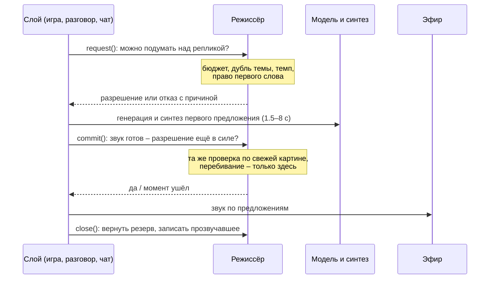
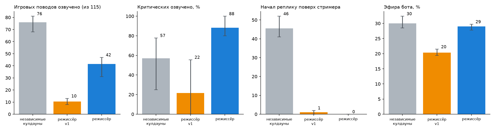
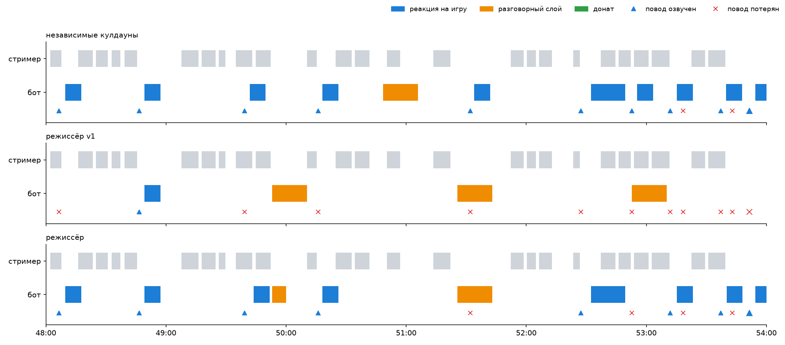

# Режиссёр эфира для голосового ИИ

[](https://github.com/doomsdayoff/realtime-voice-director/actions/workflows/tests.yml)

У меня на стриме работает голосовой ИИ-соведущий. Он комментирует игру, зачитывает
донаты и чат, разговаривает с пати. Это несколько независимых LLM-слоёв на одну
«глотку», и самый трудный вопрос в таком продукте – не «что сказать», а **когда
говорить и когда молчать**.

Здесь лежит та часть системы, которая решает этот вопрос: эталонная реализация
режиссёра эфира, потоковой озвучки и отчёта по журналу решений, а ещё симулятор,
на котором видно, зачем каждое правило. Характер бота, промпты, игровые интеграции,
голоса и оформление стрима в репозиторий не входят – см. [что закрыто](#что-закрыто).

## Задача

Поначалу «говорить или нет» решали пять мест, не знавших друг о друге: кулдаун реакции
на игру, правило «уже говорю – дропаю», пауза разговорного слоя, кулдаун зрения,
кулдауны чата. Отсюда три жалобы разом:

- **болтовня пачками** – четыре слоя одновременно сочли момент удачным;
- **реплики невпопад** – реплику пустили, пока модель думала, момент кончился;
- **потерянные эйсы** – трипл занял кулдаун, и эйс из той же серии молча умер.

## Решение

Слои не кладут реплику в очередь сами – они просят разрешение у режиссёра
([`director/arbiter.py`](director/arbiter.py)), и выдаётся оно **в две фазы**:



Одна фаза – это TOCTOU: разрешение выдано под ситуацию, которой к звуку уже нет.

| Правило | Зачем |
|---|---|
| **Бюджет в секундах речи за минуту**, из прозвучавшего плюс резерва под выданные разрешения | Фраза на пять предложений и пять выкриков нагружают ухо по-разному. Без учёта резерва три слоя, думающие одновременно, дружно пролезут в остаток |
| **Хвост бюджета под донаты и доля под игру** | Разговорный слой просит слово втрое чаще игрового и выгребает окно первым, а реакция на игру приходит не когда удобно |
| **Критическое событие обходит бюджет** | Победа в катке обязана прозвучать |
| **Срок годности и эпохи** | Реакция на фраг живёт 9 секунд. Мысль в паузе живёт, пока длится та самая пауза |
| **Право первого слова – по VAD, а не по расшифровке** | Стример сам среагировал – бот молчит. Расшифровка отстаёт на 1–2 с и приходит, когда бот уже говорит поверх; VAD – 30 мс |
| **Терпеливая аренда** | Для реплики в разговор речь стримера – повод говорить, а не причина молчать: мысль не умирает, а ждёт паузу |
| **Перебивание – когда звук преемника готов** | Если оборвать речь в момент прихода доната, эфир молчит, пока донат синтезируется |
| **Донат не перебивается ничем** | Это деньги зрителя; эйс подождёт |
| **Журнал каждого решения** и отчёт по нему | Вслух видно только то, что бот сказал. «Отказал по бюджету» и «сломался» с дивана выглядят одинаково |

Озвучка потоковая ([`director/stream.py`](director/stream.py)): токены модели режутся на
предложения, каждое синтезируется наперёд, первое звучит, пока пишется второе. Вторая фаза
разрешения случается ровно в момент, когда готов звук первого предложения.

## Что показали живые эфиры

Цифры в этом разделе – из журналов решений реальных эфиров, а не из модели.

**03.09, болталка.** За 18 минут стример открывал рот 140 раз, генерация с глубоким рассуждением
шла 5–8 секунд, и первая версия правила «стример заговорил – выбросить мысль» оборвала 7 генераций;
до эфира дошли 9 реплик. Правило было верным для реакции на игру и самоубийственным для реплики в
разговор – так появилась терпеливая аренда. Там же задержка от разрешения до первого звука
вышла 6.8–7.8 с: разговорный слой ждал реплику целиком. Он перешёл на потоковую озвучку.

**09.09, Дота, 99 минут.** Игровые данные пришли – 115 поводов с живыми числами, – а бот про них молчал:

| Слой | Просил слово | Получил | Доля эфира бота |
|---|---:|---:|---:|
| Разговорный | 349 | 76 | 96% |
| Реакция на игру | 115 | 6 | 3% |
| Чат | 27 | 2 | 1% |

Отказы реакции на игру: «бюджет речи» – 58, «стример комментирует сам» – 49. Обе причины
оказались поломками, а не настройками:

- **Резерв врал в 2.5 раза.** Разговорный слой резервировал 7 секунд, а говорил 17.5: медиана
  по 185 репликам – 227 символов. Одна его реплика съедала всё окно болтовни, и следующую минуту
  режиссёр отказывал всем, включая реакции на игру. Победа в катке (вес 10) утонула в отказе
  «бюджет речи». Теперь длина выбирается до запроса под остаток бюджета и резервируется ровно она,
  а у игры своя доля окна.
- **Совпадение считалось реакцией.** Стример в Доте ведёт репортаж непрерывно, новая реплика
  раз в 12 секунд, и «говорил рядом с событием» стало случайностью: бот промолчал про потерянные
  казармы, потому что стример в ту секунду рассуждал про лавку. Теперь реакция – это когда он
  **открыл рот** в окне вокруг события.

**12.09, первый эфир на новых правилах.**

| | 09.09 | 12.09 |
|---|---:|---:|
| Реплик за эфир | 83, раз в 71 с | 195, раз в 38 с |
| Эфира бота | 19% | 19% |
| Доля игры в словах бота | 3% | 31% |
| Медиана реплики разговорного слоя | 231 символ (~18 с) | 89 символов (~7 с) |

Игра получила голос, но разговорный слой стал говорить короче. Причина – в лестнице длины:
между «одной фразой» (7 с) и «двумя-тремя предложениями» (17.5 с) разрыв в 2.5 раза, а потолок
окна был 18 с. Верхняя ступень выпала один раз из 142. Лестница с большим разрывом между ступенями –
это переключатель: ступени должны стоять так, чтобы типичный остаток бюджета попадал в середину.
Добавлена ступень 12 с, бюджет поднят с 30 до 42 с, доля игры – с 5 до 8 с.

## Модель эфира

Чтобы проверять правила без стрима, есть симулятор ([`sim/`](sim)): синтетический эфир с
фальшивым временем, одинаковый для всех политик. Его параметры взяты из журнала 09.09 –
115 игровых поводов за 99 минут, реплика стримера раз в ~12 с, разговорный слой просит слово раз
в ~17 с, реплика ~227 символов при 13 символах в секунду. Сами события случайные, 10 сидов.

Сначала модель надо проверить на прошлом: **на старых правилах она озвучивает 10 (8–13) игровых
поводов из 115 – в живом эфире было 5–6**, и отказы делят те же две причины. Порядок величины
сходится, поэтому сравнению политик можно верить именно как порядку величины.

| Метрика | Независимые кулдауны | Режиссёр v1 | Режиссёр |
|---|---:|---:|---:|
| Игровых поводов озвучено (из 115) | 76 (68–81) | 10 (8–13) | 42 (31–47) |
| Критических озвучено | 57% (25–78) | 22% (0–56) | 88% (80–100) |
| Реплик кастера протухло до звука | 3 (1–7) | 0 | 0 |
| Эфира бота | 30% | 20% | 29% |
| Начал реплику поверх стримера | 46 (41–52) | 1 (0–2) | 0 |
| Тишина после обрыва, с | 5 (0–8) | 0 (0–1) | 1 (0–1) |
| Незакрытых разрешений в конце | – | 0 | 0 |

Медиана по сидам, в скобках – разброс. Полная таблица – [`results/summary.md`](results/summary.md).

Независимые кулдауны говорят про игру чаще всех – и 46 раз за эфир начинают реплику, когда
стример говорит. Первая версия режиссёра почти немая, как и было в живом эфире. Текущие правила
держат ту же долю эфира, что и кулдауны, не влезают поверх стримера и озвучивают почти все
критические моменты; остаток съедают донаты, которые по правилам не перебиваются.



Шесть минут одного эфира – там, где версии расходятся сильнее всего. Это иллюстрация разницы,
типичные цифры – в таблице выше.



## Отчёт по журналу

Каждое решение режиссёра – строка JSONL. Отчёт считает по журналу, сколько каждый слой просил и
получил, задержку выдача→звук против срока годности и почему слой молчал, а в конце предлагает
правки. Вот он же на журнале первой версии в модели – и он сам называет обе поломки 09.09:

```text
слой        просил  выдано  прозвучало  задержка p50/p90   срок
caster         115      15           8     2.4 / 4.15    9.0
director       274      62          57     6.4 / 9.72    45.0
почему молчал caster: бюджет речи – 53, стример комментирует сам – 47
почему молчал director: бюджет речи – 211, рано после прошлой реплики – 1

что подкрутить:
  • caster: 53 из 115 отказов по бюджету – проверить, совпадает ли резерв с реальной длиной реплик
  • caster: 47 из 115 отказов «стример комментирует сам» – при сплошном репортаже совпадение речи с событием случайно
  • director: 211 из 274 отказов по бюджету – проверить, совпадает ли резерв с реальной длиной реплик
```

Главное число отчёта – **p90 задержки против срока годности**: если он подползает к сроку,
реплики протухают ещё до первого слова, и отчёт помечает слой как «ТЕСНО».

## Код

| Файл | Что делает |
|---|---|
| [`director/arbiter.py`](director/arbiter.py) | Режиссёр: разрешения в две фазы, бюджет, эпохи, право первого слова, терпение |
| [`director/stream.py`](director/stream.py) | Потоковая озвучка: предложения по мере генерации, синтез наперёд, commit на первом звуке |
| [`director/journal.py`](director/journal.py), [`director/report.py`](director/report.py) | Журнал решений и отчёт по нему |
| [`sim/`](sim) | Модель эфира и три политики: кулдауны, первая и текущая версии режиссёра |
| [`tests/`](tests) | Сценарии правил (каждый – одна поломка, от которой правило защищает) и проверки модели |

Всё, что режиссёр знает об эфире, приходит через интерфейс `Room` и часы, которые передаются
снаружи. Поэтому один и тот же код работает в эфире, в тестах и в симуляторе с фальшивым временем.

```bash
pip install -r requirements.txt
python -m pytest -q                        # 29 тестов
python -m sim.run                          # таблица, журналы, отчёты, графики
python -m director.report results/journal_director_seed1.jsonl
```

## Что закрыто

Продукт – это персонаж и шоу, а не механика выдачи слова. Поэтому в репозитории нет:
характера бота и промптов, «мозгов» игр (разбор состояния CS2, Доты и Лиги), банка мгновенных
возгласов, зрения по кадрам трансляции, пульта управления, интеграций с Twitch, донатами и
Discord. Эталонная реализация здесь написана заново по рабочей: без глобального состояния, с
явными зависимостями и с исторической версией правил как настройкой – чтобы её можно было
сравнить с текущей.

## Ограничения модели

- Стример в модели не реагирует на бота: говорит по своему расписанию. Поэтому «поверх стримера»
  считается по моментам, когда бот НАЧАЛ говорить, а не по общему наложению речи.
- Один профиль эфира – сплошной репортаж. В CS2, где стример молчит между раундами и открывает
  рот на событие, правила срабатывают иначе.
- Задержки генерации и длины реплик – равномерные распределения вокруг замеренных значений.
- Числа модели – порядок величины, а не прогноз: на прошлом эфире она ошибается примерно вдвое
  по числу озвученных поводов.

---

© Владислав Фёдоров, 2026. Код открыт для ознакомления, см. [LICENSE](LICENSE).
